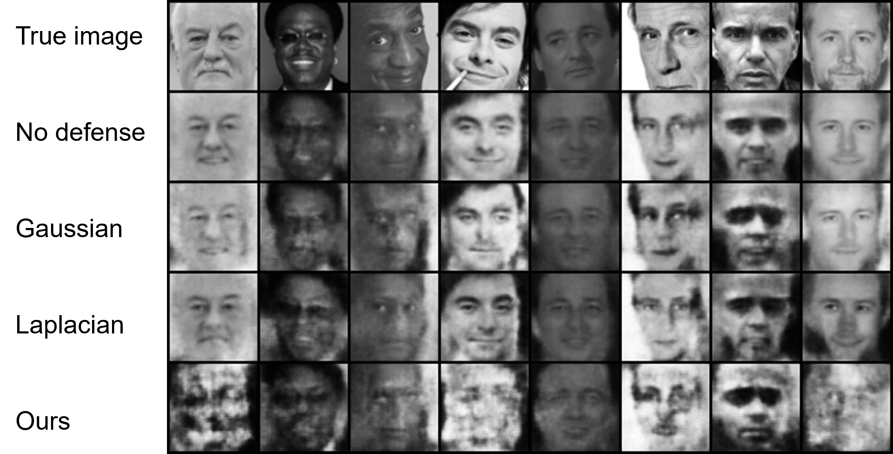

# An Approximate Memory based Defense against Model Inversion Attacks to Neural Networks



This repo provides an example of defending against model inversion attacks in the 
paper [An Approximate Memory based Defense against Model Inversion Attacks to Neural Networks](https://ieeexplore-ieee-org.proxy-um.researchport.umd.edu/document/9792582) and [MIDAS: Model Inversion Defenses Using an Approximate Memory System](https://ieeexplore.ieee.org/abstract/document/9358254)

## Shallow Neural Networks

Following the work of ["Model Inversion Attacks that Exploit Confidence Information and Basic Countermeasures"](https://dl.acm.org/doi/abs/10.1145/2810103.2813677), the classifier is trained over AT&T dataset.

### Quick Start

Run the code in ```MIDAS_shallow.ipynb```


## Deep Neural Networks

Following the work of ["Neural Network Inversion in Adversarial Setting via Background Knowledge Alignment"](https://dl.acm.org/citation.cfm?id=3354261), the classifier is trained over the Facescrub dataset. Download 150x150 aligned images from [FaceScrub](https://github.com/theothings/facescrub-dataset.git) dataset and save them in ```data/```. The inversion model is trained over public information, the CelebA dataset. Download the [CelebA](http://mmlab.ie.cuhk.edu.hk/projects/CelebA.html) dataset to ```data/``` and crop the images by ```crop.ipynb```. Please download the [trained classifier and inversion model](https://drive.google.com/drive/folders/12TgsgytXNE76FUCd74nSOmpIn8n9TVSd?usp=sharing) and save them in ```results/deep/```.


### Dependencies

The code is written in Python3. You can install the required packages by running:

```
$ pip3 install -r requirements.txt
```

### Quick Start

Run the code in ```MIDAS_deep.ipynb```


### Citation

```
@article{xu2022approximate,
  title={An Approximate Memory based Defense against Model Inversion Attacks to Neural Networks},
  author={Xu, Qian and Arafin, Md Tanvir and Qu, Gang},
  journal={IEEE Transactions on Emerging Topics in Computing},
  year={2022},
  publisher={IEEE}
}

@inproceedings{xu2020midas,
  title={MIDAS: Model Inversion Defenses Using an Approximate Memory System},
  author={Xu, Qian and Arafin, Md Tanvir and Qu, Gang},
  booktitle={2020 Asian Hardware Oriented Security and Trust Symposium (AsianHOST)},
  pages={1--4},
  year={2020},
  organization={IEEE}
}
```
